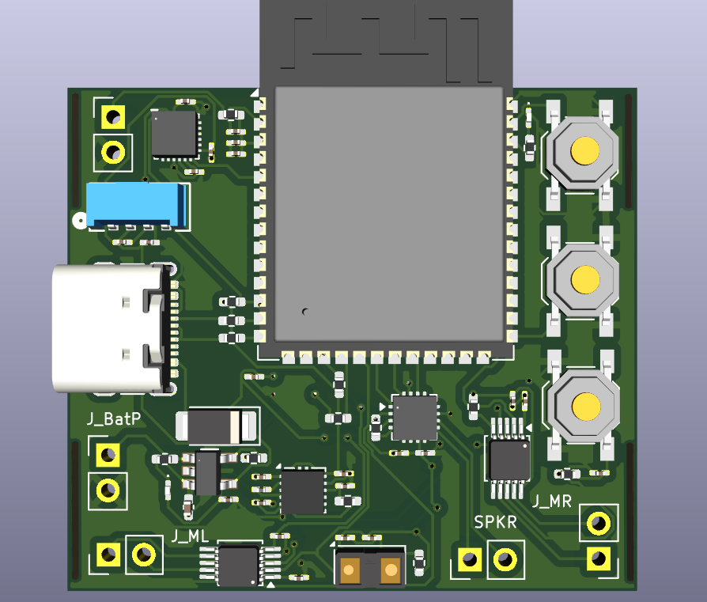
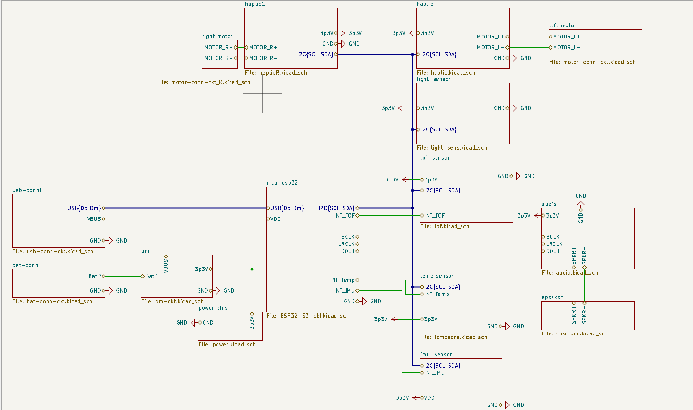
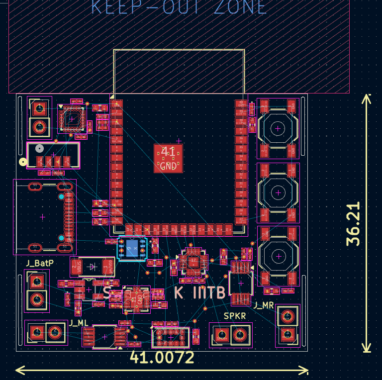
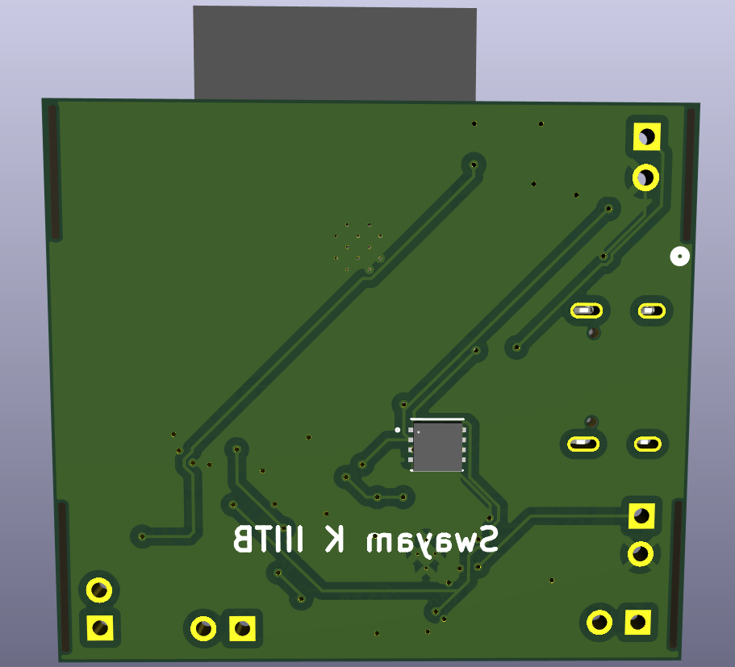

# Navigator Band — Wearable Assistive System



A compact, wrist-worn assistive device designed to provide real-time obstacle awareness through haptic and audio feedback — without relying on a smartphone, internet, or external infrastructure.

---

## 🧠 Overview

Navigator Band is a fully self-contained wearable built around the ESP32-S3. It continuously monitors the environment using multiple sensors and translates spatial information into intuitive vibration patterns and audio cues.

The system is designed to be:

* **Discreet** — wristband form factor
* **Low-power** — optimized for battery operation
* **Real-time** — no cloud or phone dependency
* **Accessible** — no visual interface required

---

## ⚙️ System Architecture


The design is divided into four major functional blocks:

### 🔌 Power Block

* USB-C input (5V)
* MCP73831 LiPo charger
* 400mAh LiPo battery
* XC6206 LDO → stable 3.3V rail

### 🧠 MCU Block

* ESP32-S3
* BLE 5.0
* I2C (sensor interface)
* I2S (audio output)

### 📡 Sensor Block

* VL53L1X — Time-of-Flight distance sensor
* ICM-42688 — IMU (orientation + motion)
* VEML7700 — Ambient light sensor
* MAX30205 — Skin temperature sensor

### 🔊 Feedback Block

* DRV2605L — Haptic driver
* Dual LRA motors (directional feedback)
* MAX98357 — I2S audio amplifier
* Speaker output

---

## 🧾 Schematic



Complete system-level schematic showing power, MCU, sensors, and feedback integration.

---

## 🧩 PCB Layout



* 2-layer PCB (40mm × 36mm)
* Compact placement optimized for wearable form factor
* Logical block separation (power, MCU, sensors, feedback)
* Short signal paths and clean routing

---

## 🎯 3D Views

### Front View


### Back View



---

## ⚡ Power Design

* Battery voltage range: **3.0V – 4.2V (LiPo)**
* Regulated to **3.3V using XC6206 LDO**
* Low quiescent current design for wearable efficiency

Power flow:

```
USB-C (5V) → MCP73831 → LiPo Battery → LDO → 3.3V rail
```

---

## 🔁 Working Principle

1. Device boots and checks skin contact using temperature sensor
2. ToF sensor measures distance continuously (~50 Hz)
3. IMU validates wrist orientation
4. Distance is mapped to feedback intensity
5. Output:

   * Haptic vibration patterns
   * Audio cues ("Turn Left", "Stop", etc.)

If the device is removed (temperature drop), the system enters deep sleep to conserve power.

---

## 🧩 PCB Design Highlights

* 2-layer PCB (40mm × 36mm)
* Full ground plane on bottom layer
* Proper decoupling capacitor placement near ICs
* Clean separation of power and signal routing
* RF antenna keepout maintained for ESP32
* ERC & DRC verified (0 errors, 0 warnings)

---

## 📦 Repository Contents

* `hardware/` — KiCad schematic & PCB files
* `images/` — renders and diagrams
* `docs/` — project documentation
* `bom/` — bill of materials
* `3D-model/` — 3D assets

---

## 🎯 Design Goals

* Compact wearable form factor
* Low power consumption
* Reliable sensor fusion
* Intuitive non-visual feedback system
* Clean and manufacturable PCB design

---

## 🚧 Future Improvements

* Replace LDO with buck-boost converter for full battery utilization
* Add enclosure design for wearable ergonomics
* Improve power efficiency under dynamic load
* Add BLE firmware support and OTA updates

---

## 👨‍💻 Author

**Swayam Kotecha**
Electronics & Communication Engineering
Electronic Systems Packaging Project

---

## 📌 Note

This project demonstrates PCB-level system integration, power management, and embedded hardware architecture for wearable assistive technology.
